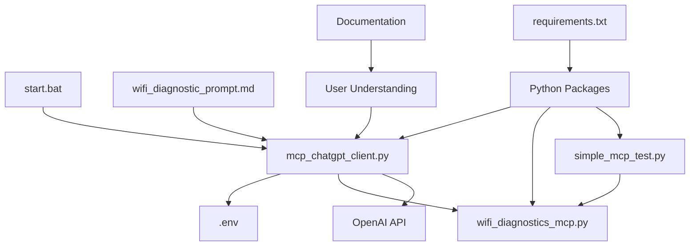

# Project Structure & File Guide

## 📁 Complete Directory Structure

```
mcp-server/open-ai-client/
├── 🔧 Core Application Files
│   ├── mcp_chatgpt_client.py      # Main GUI application
│   ├── wifi_diagnostics_mcp.py    # Example MCP server (WiFi tools)
│   ├── simple_mcp_test.py         # Connection testing utility
│   └── requirements.txt           # Python dependencies
│
├── ⚙️ Configuration Files  
│   ├── .env                       # Your API keys (create from template)
│   └── .env.template              # Configuration template
│
├── 📖 Documentation
│   ├── README.md                  # Project overview & quick start
│   ├── USER_GUIDE.md             # Detailed usage instructions
│   ├── TECHNICAL_DOCS.md         # Advanced configuration & development
│   ├── EXAMPLES.md               # Sample interactions & use cases
│   └── PROJECT_STRUCTURE.md      # This file
│
├── 📋 Templates & Prompts
│   └── wifi_diagnostic_prompt.md  # Ready-to-use comprehensive WiFi diagnostic prompt
│
└── 🚀 Utilities
    └── start.bat                  # Windows quick-start script
```

## 📝 File Descriptions

### Core Application Files

#### `mcp_chatgpt_client.py` 
**Main Application** - The GUI chat client that bridges MCP servers with ChatGPT
- **Purpose**: Provides desktop chat interface with ChatGPT + MCP tool integration
- **Features**: Threading, GUI, OpenAI API integration, MCP protocol handling
- **Usage**: `python mcp_chatgpt_client.py`
- **Dependencies**: tkinter, openai, mcp, python-dotenv

#### `wifi_diagnostics_mcp.py`
**Example MCP Server** - Windows WiFi diagnostic and troubleshooting tools
- **Purpose**: Demonstrates MCP server implementation with practical WiFi tools
- **Tools Provided**: 6 WiFi diagnostic functions (status, connectivity, auth, environment, reports, fixes)
- **Usage**: Can run standalone or via the client
- **Requirements**: Windows, PowerShell, admin rights for some tools

#### `simple_mcp_test.py`
**Diagnostic Utility** - Standalone MCP connection tester
- **Purpose**: Debug MCP server connections independently of main app
- **Usage**: `python simple_mcp_test.py` → enter server command → see connection results
- **When to Use**: When main app shows "MCP connection failed" errors

#### `requirements.txt`
**Dependencies** - Python package requirements
- **Contents**: openai, mcp, python-dotenv (tkinter excluded - comes with Python)
- **Installation**: `pip install -r requirements.txt`

### Configuration Files

#### `.env` 
**Your Configuration** - Contains your actual API keys and settings
- **Create from**: Copy `.env.template` and fill in your values
- **Required**: `OPENAI_API_KEY=your_key_here`
- **Security**: Never commit this file to version control

#### `.env.template`
**Configuration Template** - Example configuration with all options
- **Purpose**: Shows all available configuration options
- **Usage**: Copy to `.env` and customize

### Documentation Files

#### `README.md`
**Project Overview** - First file users should read
- **Contents**: Quick start, features overview, file descriptions
- **Audience**: New users, project overview

#### `USER_GUIDE.md`
**Detailed Instructions** - Complete setup and usage guide
- **Contents**: Step-by-step setup, troubleshooting, advanced usage
- **Audience**: End users wanting complete instructions

#### `TECHNICAL_DOCS.md`
**Developer Documentation** - Advanced configuration and customization
- **Contents**: Architecture, API details, customization, security
- **Audience**: Developers, advanced users, system administrators

#### `EXAMPLES.md`
**Use Cases & Samples** - Real conversation examples and integration patterns
- **Contents**: Sample conversations, custom tool examples, integration patterns
- **Audience**: Users wanting to see practical applications

### Templates & Prompts

#### `wifi_diagnostic_prompt.md`
**Comprehensive WiFi Diagnostic** - Ready-to-paste prompt for full WiFi analysis
- **Purpose**: Guides ChatGPT through systematic WiFi troubleshooting
- **Usage**: Copy and paste entire content into chat
- **Result**: Complete 5-step WiFi diagnostic with analysis and recommendations

### Utilities

#### `start.bat`
**Quick Start Script** - Windows batch file for easy startup
- **Purpose**: Automated setup and launch sequence
- **Features**: Dependency check, .env validation, MCP server test, app launch
- **Usage**: Double-click to run, or `start.bat` from command line

## 🔄 File Relationships & Data Flow



## 🚀 Getting Started Workflow

1. **Read** `README.md` for overview
2. **Install** dependencies from `requirements.txt`
3. **Configure** API key using `.env.template` → `.env`
4. **Test** MCP connection with `simple_mcp_test.py` (optional)
5. **Run** main app with `mcp_chatgpt_client.py` or `start.bat`
6. **Try** WiFi diagnostics using `wifi_diagnostic_prompt.md`
7. **Customize** using `TECHNICAL_DOCS.md` guidance

## 📚 Learning Path

### For End Users:
1. `README.md` → `USER_GUIDE.md` → `wifi_diagnostic_prompt.md` → `EXAMPLES.md`

### For Developers:
1. `README.md` → `TECHNICAL_DOCS.md` → `EXAMPLES.md` → Source code analysis

### For Troubleshooting:
1. `USER_GUIDE.md` troubleshooting section → `simple_mcp_test.py` → `TECHNICAL_DOCS.md` debugging

## 🔧 Customization Points

### Easy Customizations:
- **API Keys**: `.env` file
- **Window Settings**: Edit `mcp_chatgpt_client.py` GUI section
- **Default Commands**: Modify prompts in startup dialogs

### Advanced Customizations:
- **New MCP Tools**: Create new MCP server based on `wifi_diagnostics_mcp.py`
- **UI Changes**: Modify tkinter interface in main client
- **Protocol Changes**: Update MCP handling based on `TECHNICAL_DOCS.md`

### Integration Options:
- **Other LLM APIs**: Modify OpenAI client section
- **Database Integration**: Add database MCP tools
- **API Integration**: Create API wrapper MCP servers

## 📋 Maintenance & Updates

### Regular Tasks:
- **Update dependencies**: `pip install -r requirements.txt --upgrade`
- **Check API usage**: Monitor OpenAI API consumption
- **Update documentation**: Keep examples current with usage patterns

### Version Control:
- **Include**: All files except `.env`
- **Exclude**: `.env`, `__pycache__/`, `*.pyc`, `crash_log.txt`
- **Backup**: Configuration and custom MCP servers

---

**Quick Reference:**
- **Start app**: `python mcp_chatgpt_client.py` or double-click `start.bat`
- **Test connection**: `python simple_mcp_test.py`
- **WiFi diagnostic**: Copy/paste `wifi_diagnostic_prompt.md` content
- **Troubleshooting**: Check `USER_GUIDE.md` → `TECHNICAL_DOCS.md`